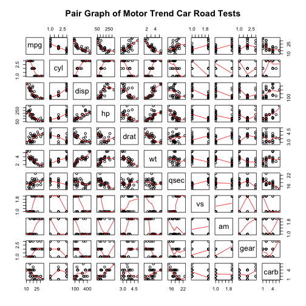
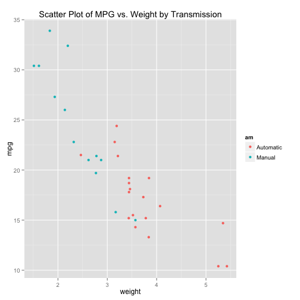
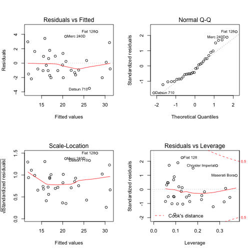

  
## Executive Summary  
In this report, we will analyze `mtcars` data set and explore the relationship between a set of variables and miles per gallon (MPG). The data was extracted from the 1974 *Motor Trend* US magazine, and comprises fuel consumption and 10 aspects of automobile design and performance for 32 automobiles (1973–74 models). We will use regression models and exploratory data analyses to mainly explore how **automatic** (am = 0) and **manual** (am = 1) transmissions features affect the **MPG** feature. 

## Exploratory Data Analysis  
First, we load the data set `mtcars` and change some variables from `numeric` class to `factor` class.   

```r
library(ggplot2)
data(mtcars)
mtcars[1:3, ] # Sample Data
```

```
##                mpg cyl disp  hp drat    wt  qsec vs am gear carb
## Mazda RX4     21.0   6  160 110 3.90 2.620 16.46  0  1    4    4
## Mazda RX4 Wag 21.0   6  160 110 3.90 2.875 17.02  0  1    4    4
## Datsun 710    22.8   4  108  93 3.85 2.320 18.61  1  1    4    1
```

```r
dim(mtcars)
```

```
## [1] 32 11
```

```r
mtcars$cyl <- as.factor(mtcars$cyl)
mtcars$vs <- as.factor(mtcars$vs)
mtcars$am <- factor(mtcars$am)
mtcars$gear <- factor(mtcars$gear)
mtcars$carb <- factor(mtcars$carb)
attach(mtcars)
```

```
## The following objects are masked from mtcars (pos = 3):
## 
##     am, carb, cyl, disp, drat, gear, hp, mpg, qsec, vs, wt
## 
## The following object is masked from package:ggplot2:
## 
##     mpg
```
Then, we do some basic exploratory data analyses. Please refer to the **Appendix: Figures** section for the plots. According to the box plot, we see that manual transmission yields higher values of MPG in general. And as for the pair graph, we can see some higher correlations between variables like "wt", "disp", "cyl" and "hp".  

## Inference  
At this step, we make the null hypothesis as the MPG of the automatic and manual transmissions are from the same population (assuming the MPG has a normal distribution). We use the two sample T-test to show it.  

```r
result <- t.test(mpg ~ am)
result$p.value
```

```
## [1] 0.001373638
```
Since the p-value is 0.00137, we reject our null hypothesis. So, the automatic and manual transmissions are from different populations.  


## Regression Analysis  
First, we fit the full model as the following.  

```r
fullModel <- lm(mpg ~ ., data=mtcars)
summary(fullModel) # results hidden
```
This model has the Residual standard error as 2.833 on 15 degrees of freedom. And the Adjusted R-squared is 0.779, which means that the model can explain about 78% of the variance of the MPG variable. However, none of the coefficients are significant at 0.05 significant level.  

Then, we use backward selection to select some statistically significant variables.  

```r
stepModel <- step(fullModel, k=log(nrow(mtcars)))
summary(stepModel) # results hidden
```
This model is "mpg ~ wt + qsec + am". It has the Residual standard error as 2.459 on 28 degrees of freedom. And the Adjusted R-squared is 0.8336, which means that the model can explain about 83% of the variance of the MPG variable. All of the coefficients are significant at 0.05 significant level.    

Please refer to the **Appendix: Figures** section for the plots again. According to the scatter plot, it indicates that there appear to be an interaction term between "wt" variable and "am" variable, since automatic cars tend to weigh heavier than manual cars. Thus, we have the following model including the interaction term:  

```r
amIntWtModel<-lm(mpg ~ wt + qsec + am + wt:am, data=mtcars)
summary(amIntWtModel) # results hidden
```
This model has the Residual standard error as 2.084 on 27 degrees of freedom. And the Adjusted R-squared is 0.8804, which means that the model can explain about 88% of the variance of the MPG variable. All of the coefficients are significant at 0.05 significant level. This is a pretty good one.  

Next, we fit the simple model with MPG as the outcome variable and Transmission as the predictor variable.  

```r
amModel<-lm(mpg ~ am, data=mtcars)
summary(amModel) # results hidden
```
It shows that on average, a car has 17.147 mpg with automatic transmission, and if it is manual transmission, 7.245 mpg is increased. This model has the Residual standard error as 4.902 on 30 degrees of freedom. And the Adjusted R-squared is 0.3385, which means that the model can explain about 34% of the variance of the MPG variable. The low Adjusted R-squared value also indicates that we need to add other variables to the model.  

Finally, we select the final model.  

```r
anova(amModel, stepModel, fullModel, amIntWtModel) 
confint(amIntWtModel) # results hidden
```
We end up selecting the model with the highest Adjusted R-squared value, "mpg ~ wt + qsec + am + wt:am".  

```r
summary(amIntWtModel)$coef
```

```
##              Estimate Std. Error   t value     Pr(>|t|)
## (Intercept)  9.723053  5.8990407  1.648243 0.1108925394
## wt          -2.936531  0.6660253 -4.409038 0.0001488947
## qsec         1.016974  0.2520152  4.035366 0.0004030165
## am1         14.079428  3.4352512  4.098515 0.0003408693
## wt:am1      -4.141376  1.1968119 -3.460340 0.0018085763
```
Thus, the result shows that when "wt" (weight lb/1000) and "qsec" (1/4 mile time) remain constant, cars with manual transmission add 14.079 + (-4.141)*wt more MPG (miles per gallon) on average than cars with automatic transmission. That is, a manual transmitted car that weighs 2000 lbs have 5.797 more MPG than an automatic transmitted car that has both the same weight and 1/4 mile time.  

## Residual Analysis and Diagnostics  
Please refer to the **Appendix: Figures** section for the plots. According to the residual plots, we can verify the following underlying assumptions:  
1. The Residuals vs. Fitted plot shows no consistent pattern, supporting the accuracy of the independence assumption.  
2. The Normal Q-Q plot indicates that the residuals are normally distributed because the points lie closely to the line.  
3. The Scale-Location plot confirms the constant variance assumption, as the points are randomly distributed.  
4. The Residuals vs. Leverage argues that no outliers are present, as all values fall well within the 0.5 bands.  

As for the Dfbetas, the measure of how much an observation has effected the estimate of a regression coefficient, we get the following result:  

```r
sum((abs(dfbetas(amIntWtModel)))>1)
```

```
## [1] 0
```
Therefore, the above analyses meet all basic assumptions of linear regression and well answer the questions.  

## Appendix: Figures  
1. Boxplot of MPG vs. Transmission  

```r
boxplot(mpg ~ am, xlab="Transmission (0 = Automatic, 1 = Manual)", ylab="MPG",
        main="Boxplot of MPG vs. Transmission")
```

 
2. Pair Graph of Motor Trend Car Road Tests  

```r
pairs(mtcars, panel=panel.smooth, main="Pair Graph of Motor Trend Car Road Tests")
```

 
3. Scatter Plot of MPG vs. Weight by Transmission  

```r
ggplot(mtcars, aes(x=wt, y=mpg, group=am, color=am, height=3, width=3)) + geom_point() +  
scale_colour_discrete(labels=c("Automatic", "Manual")) + 
xlab("weight") + ggtitle("Scatter Plot of MPG vs. Weight by Transmission")
```

 
4. Residual Plots

```r
par(mfrow = c(2, 2))
plot(amIntWtModel)
```

 
